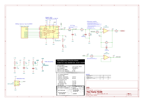

# BOMEM Preamp using PGA281

Example project which defines the output stage for the preamp.
This design omits the gain control and to support the old gain control additional circuitry is required.

eCAD: Kicad v.10.0

Does not include routing. Routing needs considerations as laid out in the datasheets.

## Schematic

